[developer.vmware.com]: https://developer.vmware.com/

## Proposal Summary

There is an opportunity to re-think how we create, manage, and deliver our public facing documentation as we separate EUC from VMware as part of the EUC divestment.

We will need to re-create or implement alternative systems for all of our public facing documentation, including the Developer Portal.

Companies, such as Microsoft and GitLab, have migrated to a documentation-as-code approach enabling customers to contribute to the public facing documentation by raising documentation issues, proposing corrections, and even directly contributing documentation through pull requests.

This document proposes we consider adopting a documentation-as-code approach for our public facing documentation, especially the Developer Portal. Considering, EUC is migrating to GitHub for its Source code management (SCM), we propose using GitHub's Documentation-as-Code offering called GitHub Pages.

A rough proof-of-concept has been created using GitHub, GitHub Pages, and MkDocs - it is available here: [EUC Developer Portal PoC](https://rcroft-work.github.io/EUCDigitalWorkspace.github.io/)

??? Info "Teams using Docs-as-Code approach"

    A number of VMware teams have been using this approach for the public documentation - see [Appendix A](#appendix-a) for examples.

## Requirements

- Hosting
    - Actual documentation
    - Possibly, the source material for documentation
    - Global i.e. host in multiple regions to performant and relevant documentation for different regions
- Granular Access Controls
    - With the intention of allowing different teams to own different parts of the documentation
        - e.g. Sales/Marketing/etc own part of content most relevant to their region while still having global content/styling/etc
        - e.g. Development teams own the documentation/content related to their APIs/SDKs
    - Providing consistent process and oversight to ensure only reviewed and approved content is published
- Customisation
    - Branding
    - Styling
        - Support various media types within the site(s)
        - Support various device format (i.e. phones, tablets, laptop computers)
    - Support different content/languages/etc for different regions
- Search and grouping of information
  - Search by date or tag or category
  - List all pages/content with a specific tags
  - List all pages/content in a specific category
- Integrations
    - EUC videos hosted via YouTube
    - Embedding of content/posts from Facebook/Instagram, X/Twitter, etc
    - Embedding of OpenAPI Specifications as part REST API or SDK documentation
    - Embedding of typical diagrams used to describe design and function of APIs/SDKs/etc
        - E.g. Architecture block diagrams
        - E.g. Sequence diagrams
        - E.g. Class and Entity diagrams
        - E.g. Swagger UI rendering of OpenAPI specifications
- Globalisation/Localisation/Multi-language support/etc
- Versioning support to align documentation with specific product/API/SDK version documented
- Ability for customers to provide feedback, raise documentation issues, and, hopefully, contribute to the public facing documentation.

## Current Approach and Structure

The current approach is to leverage the same systems that VMware provided and to find appropriate section of their documentation where our EUC documentation could be included.

The current structure of the Developer Portal under [developer.vmware.com] is:

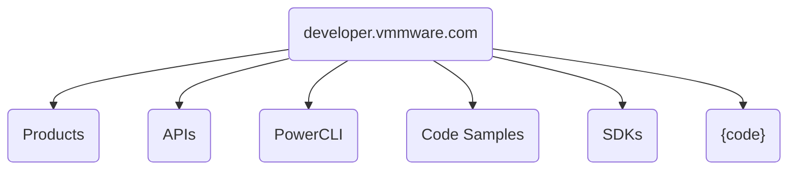

Assuming, we have access to the source material for the EUC content within [developer.vmware.com], this structure could easily be translated to a new `euc.com` domain.

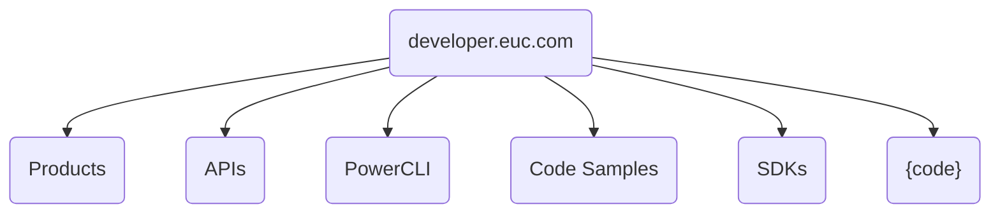

The issue is we will need to stand up documentation systems that match those used while part of VMware. This will incur additional costs and we may not want to continue using these systems as a standalone company.

## An Alternative Approach

EUC is migrating to GitHub for its Source code management (SCM). GitHub's Documentation-as-Code offering is GitHub Pages and it is included in most GitHub pricing plans. GitHub Pages hosts web sites for the organisations, teams, and open source projects that use GitHub to manage their source code. Organisations/Teams/Developers simply put the HTML/JavaScript/CSS for the website in a Git branch called `gh-pages` and GitHub will publish it to `github.io` (or a custom domain, if configured). See [Appendix B](#appendix-b) 

GitHub Pages supports a number of static (web)site generators, such as (but not limited to) Jekyll, Hugo, and MkDocs, and more. These tools allow Organisations/Teams/Developers to include their documentation in Markdown (or similar format) in the same GitHub repository as their source code and, as part of their CI/CD pipeline (via GitHub Actions), run the static site generator over the Markdown files to produce HTML/JavaScript/CSS for the website, and merge it into the `gh-pages` branch from where GitHub will publish it.

### All Public Documentation

If we were considering using a documentation-as-code approach for all of our public documentation and that documentation had the following structure:

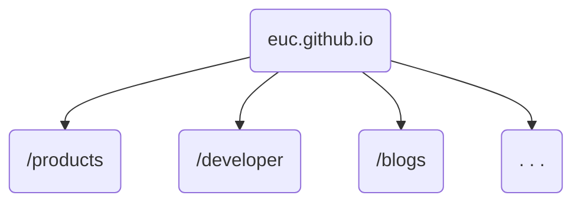

We would have a corresponding GitHub repository structure:

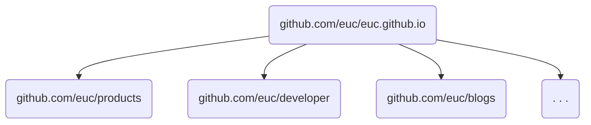

Ownership of the various sections of the public documentation, such as the `/products` area, would be granted via GitHub's access controls to the appropriate team, such as the  `Sales and Marketing` team, that has been configured within GitHub. Similarly, the Developer Portal section of the public documentation (i.e. `/developer`), would be granted to the `Engineering` team configured within GitHub. The teams configured within GitHub are synchronised with internal EUC groups via integration with our Identity Provider (WS1 Access?).

Further segmentation of the public documentation is possible by having multiple GitHub repositories and leveraging the ability of static (web)site generators to set a base URL from which all internal (to generated website) links are built. As an example, if we want to segment the /`products` section of the public documentation to have sections for each product and have each product team able to create/edit/etc content for their product _but_ no other product, we would have the following structure for the /`products` section of the public documentation:

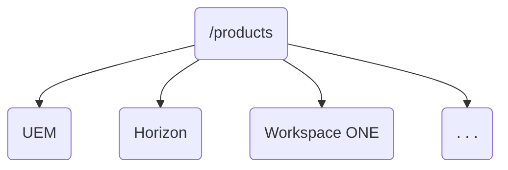

This would map to following GitHub repository structure:

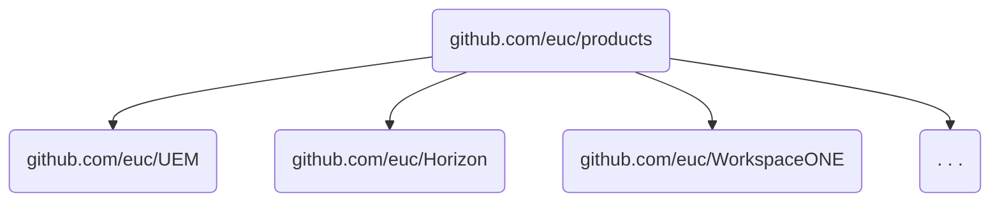

In the above example:

- the Corporate Sales and Marketing team could own the `github.com/euc/products` repository
- UEM / Horizon / Workspace ONE product Sales and Marketing teams could own their respective product-based repositories. 

This allows for Corporate Sales and Marketing team to set the overall messaging/branding (incl. styles, fonts, colours, etc) and the product-based teams inherit from corporate or, if the need arises, to override with their own messaging/branding.

??? info

    As an aside, GitHub supports are very flat hierarchy for Git repositories, namely `github.com/<org/team/user>/<repository>` where `<org/team/user>` is the organisation, team, or user name and `<repository>` is the name of the Git repository. 

    Some systems, like GitLab, support the concept of groups and sub-groups which would allow for a direct one-to-one mapping.
    e.g.

    ```mermaid
    graph TD
        B(gitlab.com/euc/products)
        B --> F(gitlab.com/euc/products/UEM)
        B --> G(gitlab.com/euc/products/Horizon)
        B --> H(gitlab.com/euc/products/WorkspaceONE)
        B --> I(. . .)
    ```

### Developer-specific Documentation

The current structure of the Developer Portal under [developer.vmware.com] is:


While it can be made to work, this current structure doesn't allow for easy or clear mapping of each section of the documentation to a single GitHub repository whose content owned by single development team.

However, if the developer section was (re)structured by product e.g.:

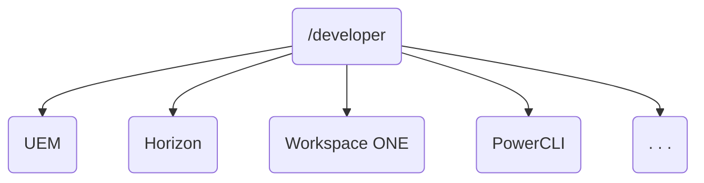

We would have a clear/clean mapping of section of the developer portal to GitHub repository which is owned by the team who builds the component/API/SDKs documented.

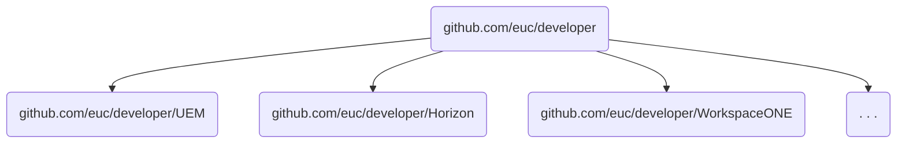

Again, as with the `/products` example above, the `/developer` section of the public documentation can be further segmented and ownership delegated to the teams who are working daily on the product that is being documented.

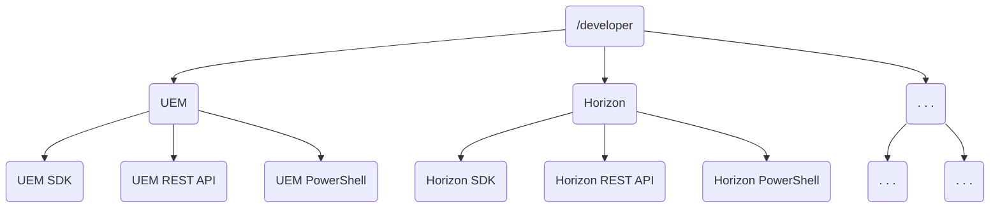

This would map to following GitHub repository structure:

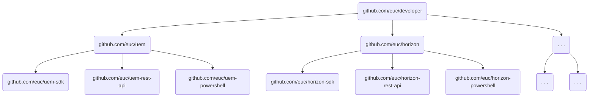

In the above example:

- the Engineering and/or Technical Market team could own the `euc.github.io/developer` section of the documentation and the corresponding `github.com/euc/developer` repository
- the UEM team could own the `euc.github.io/developer/uem` section of the documentation and the corresponding `github.com/euc/uem` and `github.com/euc/uem-*` repositories
- the Horizon team could own the `euc.github.io/developer/horizon` section of the documentation and the corresponding `github.com/euc/horizon` and `github.com/euc/horizon-*` repositories 

This allows for Engineering and/or Technical Market teams to set the overall developer messaging/branding (incl. styles, fonts, colours, etc) and the product-based teams inherit or, if the need arises, to override with their own messaging/branding.

#### API Documentation

#### PowerShell Documentation

### Blogs

Blogs could be handled in a very similar way to the other sections of the public documentation i.e. the blogs section could be structured like this:

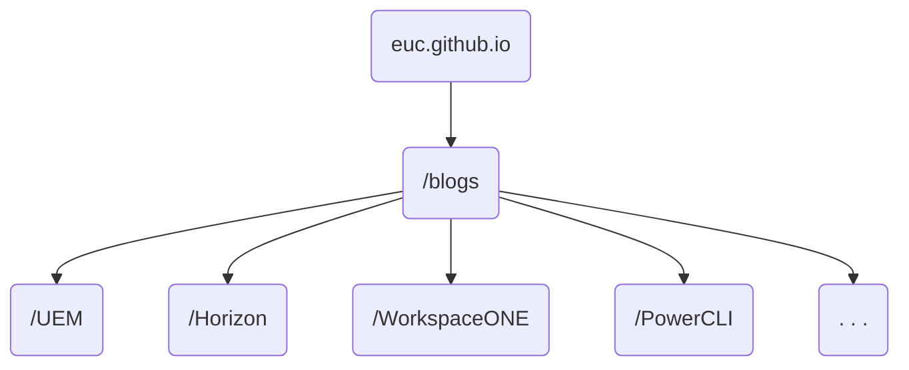

However, aggregating into a number of different channels or feeds as well as a single all blogs channel would become cumbersome and difficult to maintain very quickly.

This proposal recommends having a single blog repository and use `tags` and `categories` to group and filter the blogs posts. The static (web)site generators provide the concept of list pages where they generate pages listing all content with a particular `tag` or `category`.

For example, you can have a `UEM Developer Blog` list page that contains all blog posts with the `uem`, `uem-sdk`, `uem-rest-api`, or `uem-powershell` tags/categories.

## Appendix A

A number of VMware teams have been using this approach for the public documentation.

The Tanzu team ran the Tanzu Developer Portal from [github.com/vmware-tanzu/tanzu-dev-portal](https://github.com/vmware-tanzu/tanzu-dev-portal). The Tanzu Developer Portal contained information covering:

- Engaging with Tanzu for consulting engagements
- Tutorials/guides/process documentation for Agile software development (used as part of consulting as well)
- Episode summaries and embedded content hosted on YouTube (e.g. TanzuTV, TGIK, etc)
- Blogs from member of the Tanzu team (incl. Developer advocates, etc)

The VMware Cloud Foundation team are using this approach for:

- PowerShell Module for VMware Validated Solutions [:fontawesome-brands-github:](https://github.com/vmware/power-validated-solutions-for-cloud-foundation)  [:fontawesome-solid-book:](https://vmware.github.io/power-validated-solutions-for-cloud-foundation)
- PowerShell Module for VMware Cloud Foundation [:fontawesome-brands-github:](https://github.com/vmware/powershell-module-for-vmware-cloud-foundation) [:fontawesome-solid-book:](https://vmware.github.io/powershell-module-for-vmware-cloud-foundation)
- PowerShell Module for VMware Cloud Foundation Reporting [:fontawesome-brands-github:](https://github.com/vmware/powershell-module-for-vmware-cloud-foundation-reporting) [:fontawesome-solid-book:](https://vmware.github.io/powershell-module-for-vmware-cloud-foundation-reporting)
- PowerShell Module for VMware Cloud Foundation Password Management [:fontawesome-brands-github:](https://github.com/vmware/powershell-module-for-vmware-cloud-foundation-password-management) [:fontawesome-solid-book:](https://vmware.github.io/powershell-module-for-vmware-cloud-foundation-password-management)
- PowerShell Module for VMware Cloud Foundation Certificate Management [:fontawesome-brands-github:](https://github.com/vmware/powershell-module-for-vmware-cloud-foundation-certificate-management) [:fontawesome-solid-book:](https://vmware.github.io/powershell-module-for-vmware-cloud-foundation-certificate-management)

## Appendix B

The following table shows how to translate your organisation/team/user repository structure to GitHub Pages URL:

| Repo Name                      | Repo URL                                          | GitHub Pages URL                                  |
|--------------------------------|---------------------------------------------------|---------------------------------------------------|
| `<username>.github.io`         | `https://github.com/<username>.github.io`         | `http(s)://<username>.github.io`                  |
| `<organization>.github.io`     | `https://github.com/<organization>.github.io`     | `http(s)://<organization>.github.io`              |
| `<organization-user>.github.io`| `https://github.com/<organization-user>.github.io`| `http(s)://<organization-user>.github.io`         |
| `<username>/<repositiory>`     | `https://github.com/<username>/<repositiory>`     | `http(s)://<username>.github.io/<repository>`     |
| `<organization>/<repositiory>` | `https://github.com/<organization>/<repositiory>` | `http(s)://<organization>.github.io/<repository>` |

### References

- [About GitHub Pages - GitHub Docs](https://docs.github.com/en/pages/getting-started-with-github-pages/about-github-pages)
- [Changing the visibility of your GitHub Pages site - GitHub Enterprise Cloud Docs](https://docs.github.com/en/enterprise-cloud@latest/pages/getting-started-with-github-pages/changing-the-visibility-of-your-github-pages-site)
- [About custom domains and GitHub Pages - GitHub Docs](https://docs.github.com/en/pages/configuring-a-custom-domain-for-your-github-pages-site/about-custom-domains-and-github-pages)

## Appendix C

Everything in one diagram:

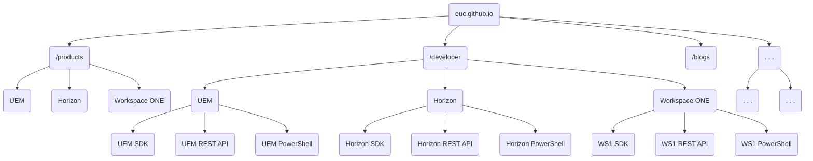

## Appendix D

Alternative function-based structure in one diagram:

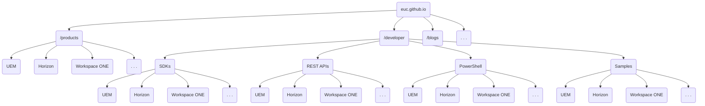
