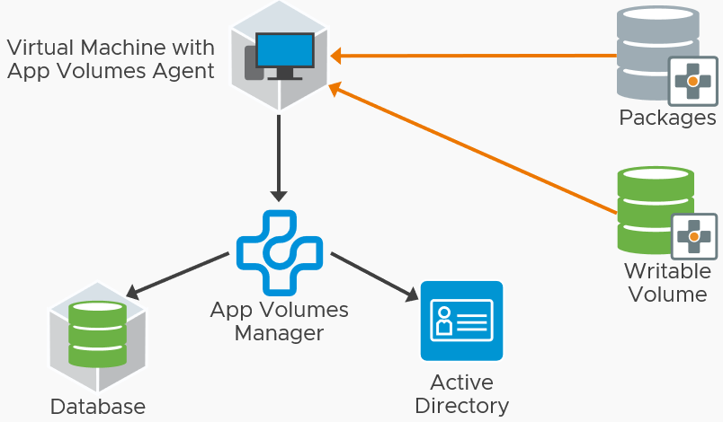

The core components of App Volumes include the App Volumes Agent running in the virtual machine and communicating with the App Volumes Managers. Application package assignments are processed and attached to the virtual machine either at logon, or on-demand, when the user launches the application. If the user has a writable volume assigned to them, that is attached to the virtual machine as well.

The key components of App Volumes are:

- **App Volumes Manager** – Acts as the broker for App Volumes Agents for the assignment of Packages and Writable Volumes. Multiple App Volumes Managers are deployed behind a third-party load balancer.
- **App Volumes Agent** – Installed on the guest OS of the target VM or system. This agent communicates with the App Volumes Managers. It adds an abstraction layer to the file systems and registry.
- **Application** -  Logical component containing one or more packages. Used to assign AD users and groups to packages.
- **Package** – A particular version of an application. A package is stored in a read-only volume containing the captured programs. The package virtual disk file is attached to deliver the applications to VDI or RDSH machines. One or more packages may be assigned per user or machine.
- **Writable Volumes** – Read-write volume that persists changes written in the session, including user-installed applications and user profile. One Writable Volume per user.

Learn more about how App Volumes works, what to consider, and how to design deployments by reviewing the [App Volumes Reference Architecture](https://techzone.vmware.com/resource/app-volumes-architecture).
