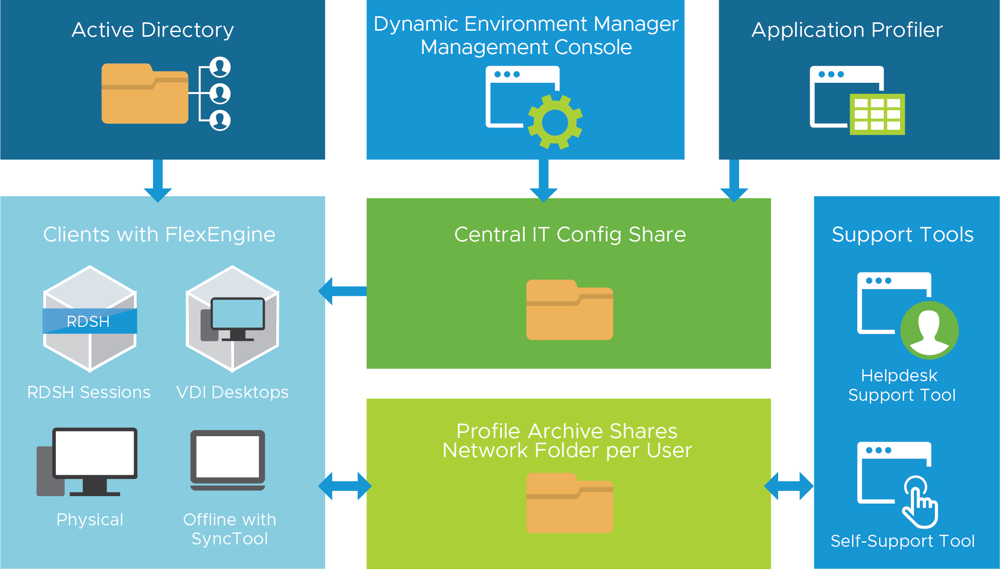

A robust solution for profile management through dynamic policy configuration that combines the ease of managing application and persona settings with providing end users a personalized desktop experience across any virtual, physical, and cloud-based Windows desktop environment.

Dynamic Environment Manager uses file shares to distribute policies, personalization,  and to store user profile information. This makes it simple to deploy, and light on infrastructure requirements.

Learn more about how Dynamic Environment Manager works, what to consider, and how to design deployments by reviewing the [Dynamic Environment Manager Reference Architecture](https://techzone.vmware.com/resource/dynamic-environment-manager-architecture).
