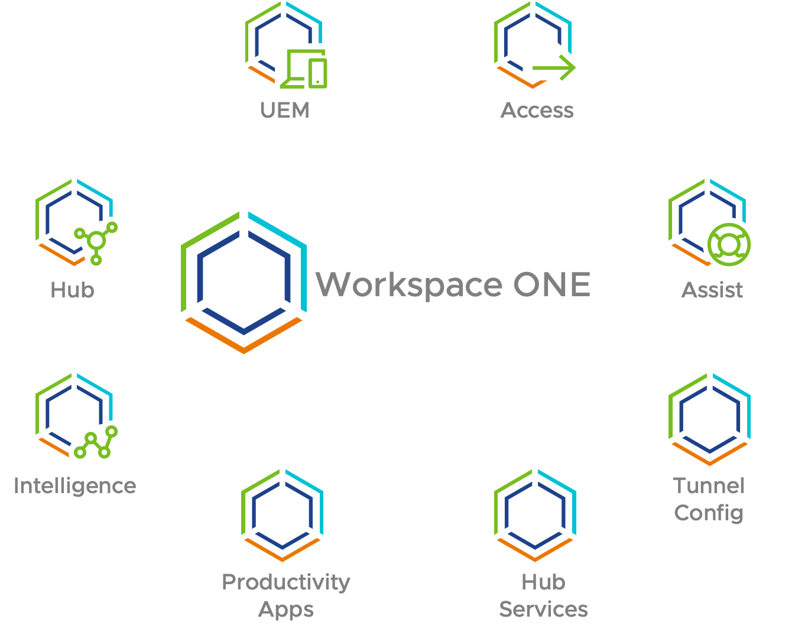
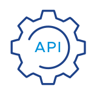

    </img>

Lorem ipsum dolor sit amet, consectetur adipiscing elit. Pellentesque nec maximus ex. Sed consequat, nulla quis malesuada dapibus, elit metus vehicula erat, ut egestas tellus eros at risus. In hac habitasse platea dictumst. Phasellus id lacus pulvinar erat consequat pretium. Morbi malesuada arcu mauris Nam vel justo sem. Nam placerat purus non varius luctus. Integer pretium leo in sem rhoncus, quis gravida orci mollis. Proin id aliquam est. Vivamus in nunc ac metus tristique pellentesque. Suspendisse viverra urna in accumsan aliquet.

Donec volutpat, elit ac volutpat laoreet, turpis dolor semper nibh, et dictum massa ex pulvinar elit. Curabitur commodo sit amet dolor sed mattis. Etiam tempor odio eu nisi gravida cursus. Maecenas ante enim, fermentum sit amet molestie nec, mollis ac libero. Vivamus sagittis suscipit eros ut luctus.

Nunc vehicula sagittis condimentum. Cras facilisis bibendum lorem et feugiat. In auctor accumsan ligula, at consectetur erat commodo quis. Morbi ac nunc pharetra, pellentesque risus in, consectetur urna. Nulla id enim facilisis arcu tincidunt pulvinar. Vestibulum laoreet risus scelerisque porta congue. In velit purus, dictum quis neque nec, molestie viverra risus. Nam pellentesque tellus id elit ultricies, vel finibus erat cursus.

## Featured Resources for Developers

- <figure markdown="span">
    { width="64" }
    <caption>**APIs**</caption>
    </figure> 
    
    Build on VMware products, manage & automate your infrastructure

- <figure markdown="span">
    { width="64" }
    <caption>**Sample Exchange**</caption>
    </figure> 
    
    Find and share code samples for VMware APIs, SDKs and CLIs

- <figure markdown="span">
    { width="64" }
    <caption>**PowerCLI**</caption>
    </figure> 

    Use PowerShell to manage & automate VMware infrastructure

- <figure markdown="span">
    { width="64" }
    <caption>**Open Source**</caption>
    </figure> 

    View open source projects and initiatives from our community

- <figure markdown="span">
    { width="64" }
    <caption>**Tools**</caption>
    </figure> 

    Find utilities and tools for OVF packages, Aria (vRealize) file management, remote management of ESXi hosts, automated log management and more.

- <figure markdown="span">
    { width="64" }
    <caption>**Tanzu Developer Center**</caption>
    </figure> 

    Visit the Tanzu Developer Center for guides, code samples, workshops, and videos, all to help you learn the modern application development patterns you need to run apps using containers and Kubernetes, build microservices with Spring, and more!

- <figure markdown="span">
    { width="64" }
    <caption>**Developer Training**</caption>
    </figure> 

    Visit Pathfinder to learn how VMware solutions are solving business problems for top enterprises. Evaluate by experiencing a day in the life of a VMware IT admin, employee or executive. Validate best methods to adopt these technologies.

- <figure markdown="span">
    { width="64" }
    <caption>**VMware Marketplace**</caption>
    </figure> 

    Explore over 2000 services and utilities on the VMware Marketplace to accelerate your modern application development. You can choose ISV solutions based on use cases, certification/validation, form factor, product compatibility and pricing.

