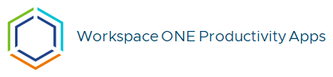

Lorem ipsum dolor sit amet, consectetur adipiscing elit. Pellentesque nec maximus ex. Sed consequat, nulla quis malesuada dapibus, elit metus vehicula erat, ut egestas tellus eros at risus. In hac habitasse platea dictumst. Phasellus id lacus pulvinar erat consequat pretium. Morbi malesuada arcu mauris Nam vel justo sem. Nam placerat purus non varius luctus. Integer pretium leo in sem rhoncus, quis gravida orci mollis. Proin id aliquam est. Vivamus in nunc ac metus tristique pellentesque. Suspendisse viverra urna in accumsan aliquet.

Donec volutpat, elit ac volutpat laoreet, turpis dolor semper nibh, et dictum massa ex pulvinar elit. Curabitur commodo sit amet dolor sed mattis. Etiam tempor odio eu nisi gravida cursus. Maecenas ante enim, fermentum sit amet molestie nec, mollis ac libero. Vivamus sagittis suscipit eros ut luctus.

Nunc vehicula sagittis condimentum. Cras facilisis bibendum lorem et feugiat. In auctor accumsan ligula, at consectetur erat commodo quis. Morbi ac nunc pharetra, pellentesque risus in, consectetur urna. Nulla id enim facilisis arcu tincidunt pulvinar. Vestibulum laoreet risus scelerisque porta congue. In velit purus, dictum quis neque nec, molestie viverra risus. Nam pellentesque tellus id elit ultricies, vel finibus erat cursus.

- 

    ---

    Digital workspace platform that enables zero trust

    [:octicons-arrow-right-24: Reference](#)

- 

    ---

    Multi-platform endpoint and app management

    [:octicons-arrow-right-24: Reference](#)
    
- 
    
    ---

    Focus on your content and generate a responsive and searchable static site

    [:octicons-arrow-right-24: Reference](#)

- 

    ---

    Focus on your content and generate a responsive and searchable static site

    [:octicons-arrow-right-24: Reference](#)

- 

    ---

    Employee launching-pad, makes login easy especially for those with bring your own (BYO) devices

    [:octicons-arrow-right-24: Reference](#)

- 
    
    ---

    Securely discover, access, and connect to your company’s resources, teams, and workflows

    [:octicons-arrow-right-24: Reference](#)

- 

    ---

    Remote support for digital employees

    [:octicons-arrow-right-24: Reference](#)

- 
    
    ---

    Connect your end users to the applications and desktops they want to access

    [:octicons-arrow-right-24: Reference](#)

- 

    ---

    Manage time, projects, passwords, to-do lists, and be more productive

    [:octicons-arrow-right-24: Reference](#)
    
- 

    ---

    Secure virtual desktop (VDI) and app platform

    [:octicons-arrow-right-24: Reference](#)

